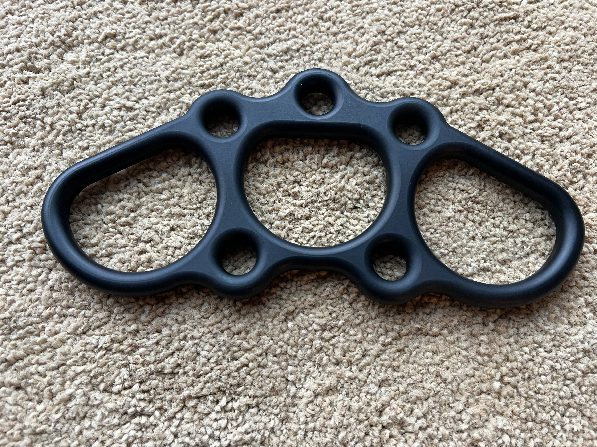

# Aluminum Rigging Plate

This repository provides detailed instructions, files, and Finite Element Analysis (FEA) results for manufacturing  the OpenRiggingPlate - a **7075-T6 Anodized Aluminum Rigging Plate** designed for various rigging applications.

---

## 📂 Project Files

- **3D Model STEP file**: [`riggingplate-14mar2024.step`](riggingplate-14mar2024.step)  
  *(Ready to upload to CNC services)*

- **SolidWorks Source File**: [`riggingplate-14mar2024.sldprt`](riggingplate-14mar2024.sldprt)  
  *(Modify or customize the design)*

- **Manufacturing Notes PDF**: [`riggingplate-14mar2024-manufacturingnotes.pdf`](riggingplate-14mar2024-manufacturingnotes.pdf)  
  *(Detailed anodizing instructions included—upload this PDF to your machining service.)*

- **Finite Element Analysis**: Refer to the provided `FEA Analysis` folder for detailed results and loading conditions.

---

## 📌 Design Specifications

| Property            | Specification                   |
|---------------------|---------------------------------|
| **Dimensions**      | 235.58 × 111.9 × 12 mm          |
| **Material**        | Aluminum 7075-T6 (**Do NOT substitute with 6061, as it WILL fail**) |
| **Volume**          | 92,450.06 mm³                   |
| **Surface Finish**  | CNC machining to **Ra1.6 or better**; hand polishing preferred |
| **Coating**         | Hardcoat Anodizing Type III (Default: Black, other colors optional) |
| **Tolerances**      | ISO 2768 medium                 |

---

## 🛠️ How to Manufacture

Follow these step-by-step instructions to have this rigging plate professionally CNC machined:

### **Step 1: Review Files**
- Download all provided files, especially the `.STEP` file for manufacturing and the PDF for anodizing guidelines.

### **Step 2: Choose a CNC Machining Service**
Recommended machining providers:
- [Protolabs](https://www.protolabs.com/)
- [JLCPCB](https://jlcpcb.com/)
- [PCBWay](https://www.pcbway.com/)
- [Xometry](https://www.xometry.com/)
- [Fictiv](https://www.fictiv.com/)

### **Step 3: Upload Files**
- Create an account and log in to your chosen machining service.
- Upload the provided STEP file: `riggingplate-14mar2024.step`.
- **Important:** Upload the PDF file `riggingplate-14mar2024-manufacturingnotes.pdf` with detailed manufacturing and anodizing instructions.

### **Step 4: Specify Material**
- Select **Aluminum 7075-T6** explicitly (critical for safety—6061 WILL fail under load).

### **Step 5: Define Surface Finish**
- Request CNC machining to a minimum surface roughness of **Ra1.6 or better**.
- Specify additional **hand polishing** for a smoother, superior finish.

### **Step 6: Specify Anodizing**
- Select **Type III Hardcoat Anodizing**.
- Default color: **Black** (other colors optional based on preference).
- **Important:** Clearly communicate hanger positions as shown in the provided PDF to minimize visible marks.

### **Step 7: Include Special Instructions**
Copy and paste the following note into the manufacturing special instructions:

> "Please carefully follow the instructions in the provided PDF file (`riggingplate-14mar2024-manufacturingnotes.pdf`) to minimize anodization marks from hanging, restricting marks only to the indicated areas."

### **Step 8: Order & Delivery**
- Confirm all details and submit your order.

---

## 📈 Finite Element Analysis (FEA)

FEA has been thoroughly conducted. The design passed static structural analyses using ANSYS software with remote displacement, allowing rotation about the Z-axis (in and out of page) to simulate realistic load conditions.

### FEA Test Cases and Loading Directions

Refer to the image below to understand each test scenario clearly:

**Minimum Breaking Strength (MBS) Results:**

| Test Case | Direction            | Breaking Strength (lbf) |
|-----------|----------------------|-------------------------|
| 1         | Vertical             | 2697.7                  |
| 2         | Angled horizontal    | 2384.5                  |
| 3         | Angled horizontal    | 4768.8                  |
| 4         | Angled horizontal    | 2222.5                  |
| 5         | Horizontal           | 2810.1                  |
| 6         | Angled horizontal    | 3372.1                  |
| 7         | Angled downward      | 3034.9                  |

Detailed FEA results are available in the `FEA Analysis` folder.

---

## 🚧 Important Notes

- **Material Integrity**: Strict adherence to **7075-T6 aluminum** is required for structural safety. Using weaker materials like 6061 will result in structural failure.
- **Anodizing Hangers**: Carefully follow the instructions in the provided PDF to minimize cosmetic defects from the anodizing process.

---

## 🔧 Modifying the Design

If you wish to customize or adapt the design for specific needs, use the provided SolidWorks source file:

- [`riggingplate-14mar2024.sldprt`](riggingplate-14mar2024.sldprt)

This file allows you to easily modify dimensions, hole positions, or structural features using SolidWorks software.

---

## 📧 Contact

Please open an issue or a pull request on GitHub if you find any errors or have suggestions for improvement.

Happy rigging!

---  
